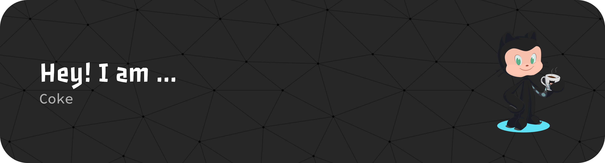

<!--  -->

### Hi there 👋

## 🎉 My Contribution Snake

## 💭 GitHub Stats

  
  

<picture>
  <source media="(prefers-color-scheme: light)" srcset="https://raw.githubusercontent.com/IceCokei/IceCokei/output/snake.svg">
  <source media="(prefers-color-scheme: dark)" srcset="https://raw.githubusercontent.com/IceCokei/IceCokei/output/snake-dark.svg">
  
</picture>
