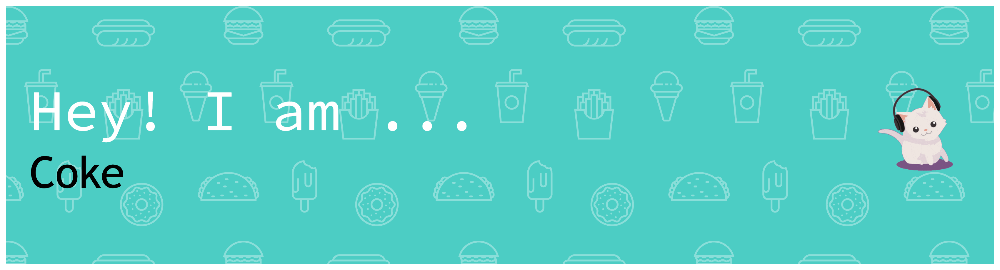

<picture>
  <source media="(prefers-color-scheme: light)" srcset="./Whitebackground.png">
  <source media="(prefers-color-scheme: dark)" srcset="./Blackbackground1.png">
  
</picture>

## 💭 GitHub Stats

  
  

## 🎉 My Contribution Snake

<picture>
  <source media="(prefers-color-scheme: light)" srcset="https://raw.githubusercontent.com/IceCokei/IceCokei/output/snake.svg">
  <source media="(prefers-color-scheme: dark)" srcset="https://raw.githubusercontent.com/IceCokei/IceCokei/output/snake-dark.svg">
  
</picture>

## 👀 Contribution Activity

<picture>
  <source media="(prefers-color-scheme: light)" srcset="https://github-readme-activity-graph.vercel.app/graph?username=IceCokei&bg_color=ffffff&color=000000&line=9be9a8&point=40c463&area=true&hide_border=true">
  <source media="(prefers-color-scheme: dark)" srcset="https://github-readme-activity-graph.vercel.app/graph?username=IceCokei&bg_color=0d1117&color=58a6ff&line=1f6feb&point=58a6ff&area=true&hide_border=true">
  
</picture>